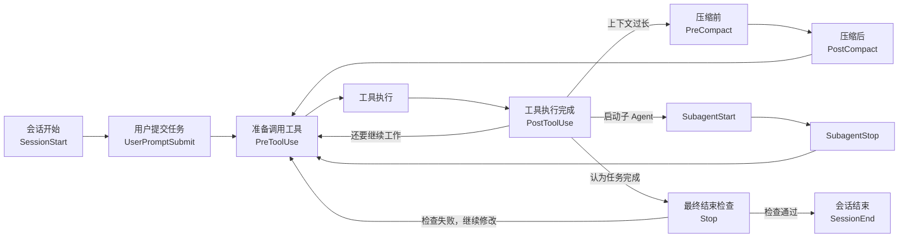
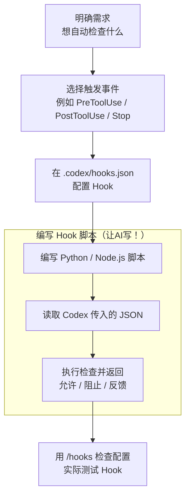

---
cssclasses:
  - agent-hooks
---

## 1. Agent Hooks 是什么，以及底层运行机制

Hook 也就是“钩子”。在 AI Agent 中，它是一种**生命周期自动化机制**：当 Agent 运行到某个特定节点时，由 Claude Code、Codex 这类 Agent 软件主动触发用户预先配置好的处理器，而不是等待大模型自己决定要不要执行。

**Hook 的触发由 Agent 的运行环境控制，不依赖大模型自己“记得”执行。** 也就是说，Hook 配置在 Agent 运行环境中，而不是依赖大模型。

不过，“Hook 是确定性的”不能理解成“Hook 永远不会失败”。更准确的说法是：

> Hook 的触发机制比自然语言指令更确定，但 Hook 自己仍可能因为脚本报错、超时、配置错误而失败；如果 Hook 内部再次调用大模型进行判断，判断结果本身仍然具有模型的不确定性。

Agent 的完整运行过程可以简单理解为：用户输入 → 大模型推理 → Agent 准备执行工具 → Agent 运行环境检查 Hook → 执行或阻止工具 → 将结果交回大模型 → 大模型继续工作。

### Hook 与其他 Agent 机制的区别

| 机制 | 可以怎样理解 | 主要解决的问题 | 是否依赖模型主动执行 |
|---|---|---|---|
| Prompt（提示词） | 当前这次告诉 AI 做什么 | 一次性任务要求 | 是 |
| `CLAUDE.md` / `AGENTS.md` | 项目长期说明书 | 项目背景、规则、编码规范 | 是 |
| Skill（技能） | 一套可复用工作方法 | 固定流程、专业能力 | 是，通常由用户或 Agent 调用 |
| MCP / Tool（工具） | 给 Agent 增加手脚 | 搜索、数据库、浏览器、GitHub 等能力 | 是 |
| Hook（钩子） | 到了某个节点自动执行 | 自动检查、拦截、记录、验收 | **否，由 Agent 软件触发** |
| Permission / Sandbox（权限 / 沙箱） | 真正的安全边界 | 限制 Agent 可以访问和执行什么 | 否 |

所以可以用一个简单判断：

- 希望 AI **知道什么** → `CLAUDE.md` / `AGENTS.md`
- 希望 AI **学会怎么做** → Skill
- 希望 AI **拥有某种外部能力** → MCP / Tool
- 希望系统 **到了某个节点自动做什么** → Hook
- 希望 Agent **绝对不能越过某个权限边界** → Permission / Sandbox

Hook 很适合充当动态安全检查，但不应该完全替代权限和沙箱。

## 2. Hooks 的核心架构：事件、匹配条件、处理器和返回结果
Claude Code 和 Codex 的 Hook 配置都可以用四个概念理解。

| 组成 | 官方术语 | 回答的问题 | 例子 |
|---|---|---|---|
| 事件 | Event | 什么时候启动？ | 工具执行前 |
| 匹配条件 | Matcher | 哪些操作才处理？ | 只处理 Bash |
| 处理器 | Handler | 触发后运行什么？ | Python 安全检查脚本 |
| 返回结果 / 决策 | Result / Decision | 检查之后 Agent 怎么办？ | 允许、阻止、反馈、修改参数 |
例如，希望阻止危险 Git 命令：`PreToolUse` 事件 → 匹配 `Bash` → 运行 `check-git.py` → 脚本发现 `git reset --hard` → 返回“拒绝” → Agent 不执行命令。

配置案例：
```json
{
  "description": "保护 profile 个人资料目录，只允许读取",
  "hooks": {
    "PreToolUse": [
      {
        "matcher": "Bash|Edit|Write",
        "hooks": [
          {
            "type": "command",
            "command": "python3 \"/你的项目绝对路径/.agent-hooks/protect-profile.py\"",
            "timeout": 5,
            "statusMessage": "正在检查 profile 目录保护规则"
          }
        ]
      }
    ]
  }
}
```

### 生命周期


### 事件（Event）：什么时候执行

事件是 Agent 运行过程中提前开放出来的固定节点，例如：`SessionStart` 表示会话开始，`PreToolUse` 表示工具执行之前，`PostToolUse` 表示工具执行之后，`Stop` 表示 Agent 认为任务已经完成。

事件不是大模型主动调用的 Tool，而是 Agent 软件自己产生的生命周期信号。

### 匹配条件（Matcher）：哪些操作才需要检查

一个 `PreToolUse` 事件可能在一轮任务中出现几十次。如果 Hook 只关心 Shell 命令，就没有必要让文件读取、MCP 调用等操作也启动脚本。
可以先设置：`PreToolUse` → 只匹配 `Bash` → 再由脚本判断是不是 `git push`。这样可以减少不必要的进程启动和性能损耗。
Matcher 并不是所有事件都支持。例如 Codex 当前的 `Stop` 和 `UserPromptSubmit` 会忽略 Matcher，所以更复杂的过滤条件需要在脚本内部完成。

### 处理器（Handler）：真正执行什么

处理器就是 Hook 被触发后真正运行的部分。Claude Code 当前支持五类处理器：

| 处理器 | 实际做什么 | 常见用途 |
|---|---|---|
| Command（本地命令） | 运行 Shell、Python、Node.js 等程序 | Lint、测试、安全检查 |
| HTTP（网络请求） | 把 Hook 数据发送到 HTTP 接口 | Webhook、远程审计服务 |
| MCP Tool（MCP 工具） | 自动调用已经连接的 MCP 工具 | 数据库、Memory、Jira 等 |
| Prompt（模型判断） | 再调用一次 Claude 做单轮判断 | 语义质量检查 |
| Agent（子 Agent 判断） | 启动一个可读取文件、搜索代码的验证 Agent | 复杂代码或项目级验收 |

Claude Code 的 Agent Handler 目前仍属于实验功能。
Codex 当前原生执行 **Command（本地命令）** 和 **MCP Tool（MCP 工具）** 两类处理器。配置解析器虽然已经认识 `prompt` 和 `agent`，但目前会跳过它们；HTTP 请求则需要通过本地脚本发送。

这并不意味着 Codex Hook 不能使用 AI。例如可以：Codex Hook → Python 脚本 → **OpenAI API / OpenRouter / 本地模型 / 本地 CLI 命令（如 AGY）** → 得到 AI 判断 → Python 将结果返回 Codex。只是这部分需要用户自己写程序，Codex 暂时没有 Claude Code 那种原生 Prompt / Agent Handler。

### Hook 如何获得数据，又如何控制 Agent

Command Hook 启动脚本时，Agent 会通过标准输入 `stdin` 发送一份 JSON 数据。

以工具执行前为例，内容大致如下：

```json
{
  "hook_event_name": "PreToolUse",
  "tool_name": "Bash",
  "tool_input": {
    "command": "git reset --hard"
  }
}
```

Python 或 Node.js 脚本读取这份 JSON，就知道：当前发生了什么事件、Agent 准备调用哪个工具、Tool 的具体参数是什么。
脚本处理之后，再通过标准输出 `stdout` 返回 JSON。

例如 Claude Code 和 Codex 当前的 `PreToolUse` 都支持下面这种拒绝格式：

```json
{
  "hookSpecificOutput": {
    "hookEventName": "PreToolUse",
    "permissionDecision": "deny",
    "permissionDecisionReason": "检测到危险 Git 命令，已阻止执行。"
  }
}
```

这里也是 Hooks 最容易产生误解的地方：不同事件中的“阻止”含义并不相同。

| 事件                 | Hook 返回阻止后实际发生什么                 |
| ------------------ | -------------------------------- |
| `UserPromptSubmit` | 用户 Prompt 不继续交给模型处理              |
| `PreToolUse`       | Tool 尚未执行，可以真正阻止副作用              |
| `PostToolUse`      | Tool 已经执行，无法撤销，只能反馈问题并让 Agent 修正 |
| `SubagentStop`     | 子 Agent 不结束，继续处理问题               |
| `Stop`             | 主 Agent 不结束，根据 Hook 给出的原因继续工作    |

所以，安全检查应该尽量发生在 `PreToolUse`，而不是等到 `PostToolUse` 才发现危险操作。

## 3. Claude Code、Codex 与其他 Agent 的 Hooks 对比

截至 2026 年 8 月，Claude Code 和 Codex 都已经拥有正式的生命周期 Hook 系统，但 Claude Code 暴露的事件和处理器明显更多。

### Claude Code 与 Codex

| 能力 | Claude Code | Codex |
|---|---|---|
| **生命周期事件数量** | ✅ **31 类**，覆盖范围非常细 | ✅ **11 类**，覆盖核心生命周期 |
| **核心生命周期事件** | ✅ `SessionStart`、`UserPromptSubmit`、`PreToolUse`、`PermissionRequest`、`PostToolUse`、`Pre/PostCompact`、`SubagentStart/Stop`、`Stop`、`SessionEnd` 均支持 | ✅ 上述核心事件基本全部支持 |
| **扩展生命周期事件** | ✅ 额外支持文件变化、配置变化、`CLAUDE.md` 加载、Tool 失败、并行 Tool 完成、Task、Agent Team、Worktree、Notification、MCP 用户交互等 | ❌ 暂无这些细粒度事件 |
| **本地命令 Handler** | ✅ 支持 Shell、Python、Node.js 等 | ✅ 支持 Shell、Python、Node.js 等 |
| **HTTP Handler** | ✅ 原生支持 | ❌ 不支持，需要通过本地脚本发送 HTTP 请求 |
| **MCP Tool Handler** | ✅ 原生支持 | ✅ 原生支持 |
| **Prompt 模型判断 Handler** | ✅ 原生支持，可直接调用模型进行语义判断 | ❌ 当前能解析配置，但不会执行 |
| **Agent 验证 Handler** | 🧪 原生支持，可启动验证 Subagent，目前属于实验功能 | ❌ 当前能解析配置，但不会执行 |
| **工具执行前拦截** | ✅ `PreToolUse` 可允许、拒绝、要求授权，并可修改 Tool 输入 | ✅ `PreToolUse` 可允许、拒绝，并可修改部分 Tool 输入；暂不支持 `ask` |
| **工具执行后的检查与反馈** | ✅ `PostToolUse` 可反馈问题，还支持更完整的 Tool Output 改写 | ✅ `PostToolUse` 可反馈问题，但结果改写能力相对有限 |
| **Tool 覆盖范围** | ✅ Bash、文件读写、MCP、Agent、WebSearch、WebFetch 等大量内置 Tool 都可进入 Hook | ⚠️ Bash、`apply_patch`、MCP 和多数本地 Tool 可进入 Hook；`WebSearch` 等 Hosted Tool 不经过 `Pre/PostToolUse` |
| **Matcher 精细过滤** | ✅ Matcher 之外还有 `if`，可进一步按具体命令过滤，如只匹配 `git push` | ⚠️ 支持 Matcher；更细的参数判断通常需要放进 Python / Node.js 脚本 |
| **异步 Hook** | ✅ 支持，适合后台测试、通知、日志 | ✅ 支持，适合后台测试、通知、日志 |
| **Hook 配置作用域** | ✅ 用户级、项目级、本机项目级、Plugin、Skill、Subagent、Managed Policy | ✅ 用户级、项目级、Plugin、Managed 配置；作用域相对少 |
| **第三方 Hook 安全审核** | ✅ 主要依靠 Workspace Trust 等机制 | ✅ Workspace Trust + 独立 Hook Review；Hook 修改后会重新审核 |
| **整体成熟度** | 🟢 **功能更完整，已经接近完整的 Agent 生命周期扩展框架** | 🟡 **核心功能已经完善，覆盖绝大多数个人用户场景，但高级扩展能力仍少于 Claude Code** |

对于普通用户，差距没有表格看起来那么大。
如果需求只是运行 Python / Node.js 脚本、Lint、测试、检查 Git、保存记忆、发送 HTTP 请求，Claude Code 和 Codex 基本都可以完成，因为 **Command Hook 本身已经可以执行任意本地程序**。

**Claude Code 真正明显领先的地方**，是可以不写额外程序，直接让 Prompt Handler 或 Agent Handler 做 AI 语义判断。

举例：
【Prompt 模型判断 Handler】实际上是【让 Hook 临时用 AI 做一次判断】。
【Agent 验证 Handler】实际上是【派一个子 Agent 去调查后再判断】。
**Codex 目前都没有。**

### 其他主流 Agent

这些 Agent 虽然都存在类似 Hook 的生命周期扩展机制，但实现方式并没有统一。

| Agent            | Hook 实现方式                                            | 工具执行前拦截 | 普通用户实现难度 | 核心特点                                  |
| ---------------- | ---------------------------------------------------- | ------- | -------- | ------------------------------------- |
| Claude Code      | JSON 配置 + Command / HTTP / MCP / Prompt / Agent      | 支持      | 低～中      | 当前最完整的原生 Hook 系统之一                    |
| Codex            | `hooks.json` / `config.toml` + Command / MCP Tool    | 支持      | 低        | 核心生命周期完整，处理器目前偏简单                     |
| OpenCode         | JavaScript / TypeScript Plugin 事件                    | 支持      | 中        | `tool.execute.before/after` 等事件直接写进插件 |
| Hermes Agent     | Shell Hook、Plugin Hook、Gateway Hook、Outbound Webhook | 支持      | 低～高      | 普通用户可直接用 Shell Hook，复杂需求再写插件          |
| OpenClaw         | Internal Hook + Typed Plugin Hook                    | 支持      | 中～高      | 普通自动化与真正的运行时拦截分成两套机制                  |
| DeepSeek Harness | Cordis Plugin + 类型化事件系统                              | 取决于具体事件 | 高        | 整个 Harness 都采用插件/事件架构，目前仍偏开发者平台       |

OpenCode 没有要求用户建立 Claude 风格的 `hooks.json`。项目目录中的 `.opencode/plugins/*.js` 或 `.ts` 文件会被自动加载，插件可以监听 `tool.execute.before`、`tool.execute.after`、`session.compacted` 等事件。

Hermes Agent 目前有四套 Hook。对于个人用户，最值得关注的是 **Shell Hook**：直接在 `~/.hermes/config.yaml` 中声明事件并指向脚本，可以实现工具拦截、格式化、上下文注入等功能；只有更复杂的需求才需要写 Python Plugin。

OpenClaw 把两类需求分得更明确：Internal Hook 更适合 `/new`、`/reset`、Gateway 启动、消息等自动化；如果需要在工具执行前拦截、修改 Prompt 或控制 Agent 流程，则需要 Typed Plugin Hook。

DeepSeek Harness 比较特殊，它基于 Cordis，也就是【万物接插件】。
官方 Hook 桥接插件：

| 官方插件 | 用途 |
| --- | --- |
| `@deepseek-ai/dsh-hooks-claude-code` | 读取 Claude Code Hook 配置 |
| `@deepseek-ai/dsh-hooks-codex` | 读取 Codex `hooks.json` |

假设你已经有 Codex Hook：

```markdown
my-project/
├── .codex/
│   └── hooks.json
└── .agent-hooks/
    └── protect-profile.py
```

在 `~/.dsh/cordis.patch.yml` 中配置：

```yaml
- insert:
    - id: hooks-codex
      name: '@deepseek-ai/dsh-hooks-codex'
      config:
        configPath: '/Users/username/my-project/.codex/hooks.json'
```

### 普通用户真正需要掌握的核心事件

没有必要记住 Claude Code 的 31 个事件。下面几个已经覆盖绝大多数个人使用场景：

| 事件 | 中文理解 | 典型用途 | Claude Code | Codex |
|---|---|---|---|---|
| `SessionStart` | Agent 开始工作 | 加载动态项目状态、长期记忆 | 支持 | 支持 |
| `UserPromptSubmit` | Prompt 交给模型前 | 检索记忆、加入上下文、检查输入 | 支持 | 支持 |
| `PreToolUse` | Agent 真正动手前 | 危险命令、文件、MCP 操作拦截 | 支持 | 支持 |
| `PostToolUse` | Agent 动手之后 | Lint、格式化、自动检查 | 支持 | 支持 |
| `PreCompact` | 上下文压缩前 | 保存决策、进度、长期记忆 | 支持 | 支持 |
| `SubagentStop` | 子 Agent 准备结束 | 检查研究、代码等子任务质量 | 支持 | 支持 |
| `Stop` | Agent 认为任务完成 | 最终测试、Review、完成条件检查 | 支持 | 支持 |

另外值得认识 `PermissionRequest`：它发生在 Agent 已经准备向用户请求权限的时候，可以自动批准、拒绝或介入权限流程。它和 `PreToolUse` 不完全是一回事。

## 4. 普通用户应该编写哪些 Hooks：实际应用场景

普通用户通常不需要几十个 Hook。真正高价值的场景主要集中在安全、自动检查、最终验收、长期记忆和通知。

| 使用场景 | 推荐事件 | 具体实现 | 价值 |
|---|---|---|---|
| 阻止危险 Shell / Git 命令 | `PreToolUse` | Python / Node.js 检查命令 | 极高 |
| 防止修改敏感文件 | `PreToolUse` | 检查文件路径，如 `.env`、密钥文件 | 高 |
| 控制危险 MCP 写操作 | `PreToolUse` | 匹配特定 MCP Tool 并检查参数 | 高 |
| 修改代码后运行 Lint | `PostToolUse` | ESLint、Ruff、Prettier 等 | 高 |
| 修改代码后运行局部测试 | `PostToolUse` | 只测试受影响模块 | 高 |
| 任务结束前运行测试 | `Stop` | `npm test`、`pytest` 等 | 极高 |
| 完成前检查任务要求 | `Stop` | 普通脚本或 AI 判断 | 中～高 |
| 会话开始恢复记忆 | `SessionStart` | 从本地 Memory 文件 / 数据库读取 | 进阶 |
| Prompt 前检索相关记忆 | `UserPromptSubmit` | Memory Search / RAG | 进阶 |
| 上下文压缩前保存状态 | `PreCompact` | 保存决策、进度、未完成事项 | 进阶 |
| 检查子 Agent 产出 | `SubagentStop` | 检查来源、测试、交付物 | 进阶 |
| Agent 完成后通知 | `Stop` / Notification 类事件 | macOS 通知、Slack、Telegram | 按需 |

### 最值得普通用户先建立的三个 Hook

**1. `PreToolUse`：危险操作保护**

例如拦截：`git reset --hard`、`git push --force`、大范围删除命令、写入生产数据库、删除重要目录、高风险 MCP 写操作。这是最直接的安全收益。

**2. `PostToolUse`：修改后的轻量自动检查**

例如：修改 TypeScript → ESLint / TypeScript Check、修改 Python → Ruff / Pyright、修改 Markdown → Markdownlint、修改 UI → Design Detector。

这里应该做**轻量、快速、局部检查**，而不是每次修改一个文件就运行整个项目的完整测试。

**3. `Stop`：最终完成条件检查**

例如要求：测试必须通过、Lint 必须通过、指定文件必须已经生成、研究任务必须包含来源、用户要求的几个子任务不能遗漏。

`Stop` 最大的价值是解决 Agent 很常见的问题：

> 模型自己认为已经做完了，但实际上仍然有遗漏。


## 5. 从 0 创建并编写一个 Hook




下面用一个更贴近日常使用的真实案例完整走一遍：

> 项目中的 `profile/` 文件夹存放个人资料。Agent 可以读取里面的内容，但禁止修改、删除已有文件，也禁止在里面新建文件。

也就是说：

| Agent 操作 | 是否允许 |
|---|---|
| 读取 `profile/about.md` | ✅ 允许 |
| 搜索 `profile/` 中的内容 | ✅ 允许 |
| 修改已有文件 | ❌ 阻止 |
| 删除已有文件 | ❌ 阻止 |
| 新建文件 | ❌ 阻止 |

这个案例可以同时展示 `PreToolUse`（工具执行前事件）、Matcher（匹配条件）、Command Handler（本地脚本处理器）、JSON 输入输出，以及 Claude Code 和 Codex 如何共用一个 Python 检查脚本。

项目中准备三个文件：

- `.agent-hooks/protect-profile.py`：真正执行检查的公共 Python 程序
- `.claude/settings.json`：Claude Code 的 Hook 配置
- `.codex/hooks.json`：Codex 的 Hook 配置

### 第一步：把自然语言规则拆成 Hook

| 问题 | 本案例答案 |
|---|---|
| 什么时候检查？ | Agent 真正修改文件之前 |
| 使用哪个事件？ | `PreToolUse`（工具执行前） |
| 检查哪些操作？ | 文件修改工具 + Shell 命令 |
| 哪个目录受到保护？ | 项目根目录下的 `profile/` |
| 谁负责判断？ | Python 脚本 |
| 发现修改行为怎么办？ | 返回 `deny`（拒绝），Tool 不执行 |
| 读取 `profile/` 怎么办？ | 不拦截，正常允许 |

最关键的是选择 `PreToolUse`。如果改用 `PostToolUse`，Hook 被触发的时候文件已经被修改了，只能发现问题，不能阻止修改发生。

### 第二步：编写保护脚本

创建：

`.agent-hooks/protect-profile.py`

```python
#!/usr/bin/env python3

import json
import re
import sys
from pathlib import Path


# 当前脚本位于：
# <项目>/.agent-hooks/protect-profile.py
#
# 因此脚本的上一级目录就是项目根目录，
# profile/ 位于项目根目录下面。
PROJECT_ROOT = Path(__file__).resolve().parent.parent
PROTECTED_DIR = (PROJECT_ROOT / "profile").resolve()


def deny(reason: str) -> None:
    """告诉 Claude Code / Codex：拒绝这次 Tool 调用。"""
    print(json.dumps({
        "hookSpecificOutput": {
            "hookEventName": "PreToolUse",
            "permissionDecision": "deny",
            "permissionDecisionReason": reason
        }
    }, ensure_ascii=False))
    sys.exit(0)


def is_in_profile(path_text: str) -> bool:
    """判断一个文件路径是否位于 profile/ 目录中。"""
    path = Path(path_text).expanduser()

    if not path.is_absolute():
        path = PROJECT_ROOT / path

    try:
        path.resolve().relative_to(PROTECTED_DIR)
        return True
    except ValueError:
        return False


# Agent Runtime 会通过标准输入 stdin
# 把当前 Tool 调用信息作为 JSON 传给脚本。
event = json.load(sys.stdin)

tool_name = event.get("tool_name", "")
tool_input = event.get("tool_input") or {}


# --------------------------------------------------
# 1. Claude Code：Write / Edit
# --------------------------------------------------
#
# Claude Code 修改文件时，会直接提供 file_path。
# 如果目标位于 profile/ 中，直接拒绝。
if tool_name in {"Write", "Edit"}:
    file_path = tool_input.get("file_path")

    if isinstance(file_path, str) and is_in_profile(file_path):
        deny(
            "profile/ 是只读目录："
            "允许读取，但禁止新建、修改或覆盖其中的文件。"
        )


# --------------------------------------------------
# 2. Codex：apply_patch
# --------------------------------------------------
#
# Codex 的文件新增、修改、删除通常通过 apply_patch 完成。
# Hook 收到的 command 中会包含这次 Patch 的内容。
#
# 教学案例中，只要 Patch 明确涉及 profile/，
# 就阻止整个文件修改操作。
if tool_name == "apply_patch":
    patch = tool_input.get("command", "")

    if isinstance(patch, str):
        normalized = patch.replace("\\", "/")

        if re.search(r"(^|[\s/])profile/", normalized, re.MULTILINE):
            deny(
                "检测到 Codex 准备修改 profile/："
                "这个目录只允许读取，禁止新增、修改或删除文件。"
            )


# --------------------------------------------------
# 3. Shell 命令
# --------------------------------------------------
#
# Agent 也可能不用专门的文件编辑工具，
# 而是通过 rm、mv、touch、重定向等命令修改文件。
#
# 这里拦截常见的写入方式。
if tool_name in {"Bash", "PowerShell"}:
    command = tool_input.get("command", "")

    if isinstance(command, str):
        normalized = command.replace("\\", "/")

        touches_profile = bool(
            re.search(r"(^|[\s\"'])\.?/?profile(?:/|[\s\"']|$)", normalized)
        )

        write_patterns = [
            r"\brm\b",
            r"\brmdir\b",
            r"\bmv\b",
            r"\btouch\b",
            r"\bmkdir\b",
            r"\btee\b",
            r"\bsed\s+-i\b",
            r"\bchmod\b",
            r"\bchown\b",
            r">>",
            r"(?<!>)>(?!>)"
        ]

        attempts_write = any(
            re.search(pattern, normalized)
            for pattern in write_patterns
        )

        if touches_profile and attempts_write:
            deny(
                "检测到 Shell 命令准备修改 profile/："
                "这个目录只允许读取，禁止新增、修改或删除文件。"
            )


# 没有发现违规行为：
# 不输出拒绝结果，正常退出，Agent 继续执行原操作。
sys.exit(0)
```

这个脚本实际做的事情并不复杂：Agent 准备操作 → Hook 把操作信息交给 Python → Python 判断是否要修改 `profile/` → 如果是，就返回拒绝 → Agent 的 Tool 不执行。

Claude Code 和 Codex 的文件编辑方式有所不同，因此脚本分别进行了处理：

| Agent | 常见文件修改方式 | Hook 实际检查什么 |
|---|---|---|
| Claude Code | `Write` / `Edit` | `tool_input.file_path` |
| Codex | `apply_patch` | `tool_input.command` 中的 Patch |
| 两者 | Shell 命令 | `tool_input.command` |

读取操作不在这里阻止，因此 Agent 仍然可以读取 `profile/` 中的信息。

### 第三步：连接 Claude Code

在项目的：

`.claude/settings.json`

加入：

```json
{
  "hooks": {
    "PreToolUse": [
      {
        "matcher": "Write|Edit|Bash|PowerShell",
        "hooks": [
          {
            "type": "command",
            "command": "python3 \"${CLAUDE_PROJECT_DIR}/.agent-hooks/protect-profile.py\"",
            "timeout": 5
          }
        ]
      }
    ]
  }
}
```

几个关键字段：

| 配置 | 含义 |
|---|---|
| `PreToolUse` | Agent 真正执行 Tool 之前进行检查 |
| `Write|Edit` | 检查 Claude Code 的文件新增和修改 |
| `Bash|PowerShell` | 防止 Agent 绕过文件工具，改用终端命令修改 |
| `type: "command"` | Hook 运行一个本地程序 |
| `command` | 执行刚才创建的 Python 脚本 |
| `timeout: 5` | 最多等待脚本 5 秒 |

这里没有匹配 `Read`。

因此：
Agent 读取 `profile/about.md` → 不触发这个保护 Hook → 正常读取。
Agent 修改 `profile/about.md` → `Edit` → 触发 Hook → Python 判断路径 → 返回 `deny` → 修改被阻止。
Claude Code 可以通过 `/hooks` 查看当前已经加载的 Hook。

### 第四步：连接 Codex

Codex 的项目级配置写在：

`.codex/hooks.json`

```json
{
  "description": "保护 profile 个人资料目录，只允许读取",
  "hooks": {
    "PreToolUse": [
      {
        "matcher": "Bash|Edit|Write",
        "hooks": [
          {
            "type": "command",
            "command": "python3 \"/你的项目绝对路径/.agent-hooks/protect-profile.py\"",
            "timeout": 5,
            "statusMessage": "正在检查 profile 目录保护规则"
          }
        ]
      }
    ]
  }
}
```

这里需要把：`/你的项目绝对路径/` 替换成当前项目的真实路径。例如项目位于：`/Users/username/my-project`，那么：`"command": "python3 \"/Users/username/my-project/.agent-hooks/protect-profile.py\""`


Codex 修改文件时，底层使用的 Tool 名通常是 `apply_patch`，但官方允许 Matcher 使用 `Edit` 或 `Write` 作为它的别名，所以这里的：`"matcher": "Bash|Edit|Write"` 既可以检查 Shell 命令，也可以检查 Codex 的文件新增、修改和删除操作。

Codex 可以通过 `/hooks` 查看项目 Hook，并完成首次安全审核。

### 第五步：测试 Hook


#### 测试读取：应该成功

向 Claude Code 或 Codex 输入：
> 读取 `profile/about.md`，告诉我里面写了什么，不要修改任何内容。

预期结果：**允许。**

#### 测试修改：应该被阻止

输入：

> 把 `profile/about.md` 第一段改成“测试内容”。

预期结果：**Hook 在真正修改之前触发，并拒绝操作。**

Agent 应该收到类似：

> profile/ 是只读目录，允许读取，但禁止新建、修改或覆盖其中的文件。

#### 测试新建文件：应该被阻止

输入：

> 在 `profile/` 下新建一个 `test.md`，内容写“Hello”。

预期结果：**拒绝。**

#### 测试删除：应该被阻止

输入：

> 删除 `profile/test.md`。

预期结果：**拒绝。**

### 这个案例真正展示了 Hook 的什么能力

如果只在 `CLAUDE.md` 或 `AGENTS.md` 中写：**`profile/` 只能读取，绝对不能修改**。这仍然是一条给大模型看的自然语言规则。模型通常会遵守，但它仍然需要自己理解、记住并执行这条规则。

Hook 则把规则变成：**Agent 每次准备修改文件 → Agent 软件自动运行检查程序 → 发现目标位于 `profile/` → 在真正修改之前强制拒绝。**

因此这里最重要的不是 Python 代码，而是控制层发生了变化：**自然语言规则负责告诉 AI 应该怎么做；Hook 负责在关键节点真正检查 AI 准备做什么。**


> **安全提醒：这个示例主要用于理解 Hook，不能把它当作真正的隐私安全沙箱。**
>
> 原因是 Shell 命令可以非常复杂，例如 Agent 可以运行一个已有 Python 程序，而这个程序内部再去修改 `profile/`；单纯检查 Shell 命令文本不一定能够发现这种间接写入。
> 如果 `profile/` 中真的存放重要隐私数据，更可靠的方案应该是：
> **文件系统只读权限 / Agent Sandbox + Hook 动态检查**
> Hook 负责提供更友好的、针对 Agent 行为的动态保护；真正不可突破的权限边界应该交给操作系统权限或 Agent 沙箱。

## 6. 多个 Agent 如何共用一套 Hooks

Claude Code、Codex、Hermes、OpenCode 的 Hook 配置格式并不统一，因此通常**不能把一份 `.claude/settings.json` 直接复制给所有 Agent**。

但真正有价值的部分不是配置 JSON，而是业务逻辑（也就是 Hook 脚本）。前面的案例已经展示了最简单的跨 Agent 共用方式：

Claude Code `.claude/settings.json` → `.agent-hooks/check-dangerous-git.py`  
Codex `.codex/hooks.json` → `.agent-hooks/check-dangerous-git.py`

两边配置不同，但实际安全检查只有一份。

### 哪些部分可以共用

| 层次 | 是否适合共用 | 示例 |
|---|---|---|
| Agent 自己的 Hook 配置 | 通常不能直接共用 | `.claude/settings.json`、`.codex/hooks.json` |
| 事件名称 | 部分可以 | 两边都有 `PreToolUse`、`Stop` |
| Agent 输入 JSON | 很相似，但不能假设完全相同 | `tool_name`、`tool_input` |
| 真正检查规则 | **最适合共用** | Git Policy、Lint、测试、Memory |
| 返回 JSON | 部分相同，部分需要转换 | `permissionDecision`、`decision` |

因此一个同时支持多个 Agent 的项目，可以把公共程序单独放到：

- `.agent-hooks/check-dangerous-git.py`
- `.agent-hooks/check-sensitive-files.py`
- `.agent-hooks/run-quality-check.py`
- `.agent-hooks/save-memory.py`

Claude Code、Codex、Hermes 等各自只负责在正确时间调用这些程序。

## 7. 普通用户的使用建议与注意事项

Hooks 的核心目标是把**真正不能依赖模型自觉执行的少数动作**移到自动化层。

| 问题 | 建议 |
|---|---|
| Hook 应该装多少？ | 从 2～3 个真正高价值 Hook 开始，不要追求数量 |
| 什么最值得先做？ | `PreToolUse` 安全检查、`PostToolUse` 轻量检查、`Stop` 最终验收 |
| 所有规则都做成 Hook？ | 不要。普通项目规则继续放 `CLAUDE.md` / `AGENTS.md` |
| 能用代码判断还要不要 AI？ | 不要。正则、Lint、测试能解决的问题优先使用确定性程序 |
| `PostToolUse` 能保护危险操作吗？ | 不能作为事前保护，因为 Tool 已经执行 |
| Hook 能代替 Sandbox 吗？ | 不能，Hook 更适合作为动态 Guardrail（防护规则） |
| 高频 Hook 能跑完整测试吗？ | 不建议，会显著拖慢 Agent |
| Stop Hook 最大风险是什么？ | Agent 不断“检查失败 → 修改 → Stop → 再失败”的循环 |
| 可以直接安装陌生项目的 Hook 吗？ | 不应该，Command Hook 本质上拥有本地代码执行能力 |
| 多个 Hook 有固定执行顺序吗？ | 不要默认有，不同 Agent 的并发和顺序语义不同 |
| 多 Agent 一开始就需要统一框架吗？ | 不需要，优先共享 Python / TypeScript 核心脚本 |
| Hook 能看到 Agent 所有操作吗？ | 不能保证，具体取决于 Agent 暴露哪些生命周期事件 |

> **专注 AI 与个人知识管理**
> 本文属于 [杰森的效率工坊](https://jasonai.me)原创。未经允许禁止商用。
> 
> **订阅杰森的频道：**
> [YouTube](https://www.youtube.com/@JasonEfficiencyLab) · [Twitter(X)](https://x.com/JasonEffiLab) · [小红书](https://www.xiaohongshu.com/user/profile/60935957000000000101fbf7) · [B站](https://space.bilibili.com/3546884870244925)